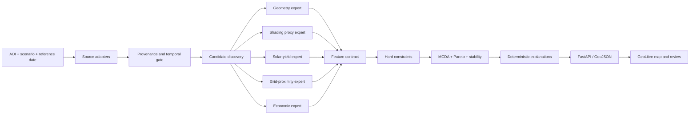

# Helios system architecture

## Objective

Helios answers a regional question: **which rooftops should a solar scouting team inspect first, and why?** It screens a bounded area using public geospatial, solar, elevation, grid-proximity and early-economic data. It returns an explainable shortlist with uncertainty and provenance instead of pretending to produce construction-ready designs.

## Architecture style

The system is a **multimodal geospatial decision pipeline with modular expert components and late feature fusion**. “Mixture of experts” is not the primary label: classic MoE systems learn a gating network that routes inputs among learned experts. Helios instead uses mostly deterministic GIS/physics modules, standardizes their outputs, and combines them with explicit MCDA weights. A learned ranker may be evaluated later as a challenger.

## Input contract

Every run includes:

- AOI as GeoJSON polygon or administrative boundary reference;
- scenario name and user constraints;
- reference date for temporal compatibility;
- optional budget, minimum usable area, maximum grid distance and preferred system size;
- explicit ranking weights that sum to one;
- versioned source manifests;
- candidate feature records from upstream modules.

The API deliberately receives already standardized candidate features in the baseline. Each data/model workstream can therefore evolve without coupling its raw formats to the ranking service.

## Processing layers

### 1. Source adapters

Adapters fetch or import building footprints, elevation/surface models, irradiance/weather, grid assets and economic proxies. They preserve raw files outside Git and emit a source manifest plus normalized geospatial layers.

The baseline building adapter uses Google Open Buildings v3 polygons and samples Open Buildings Temporal v1 heights. GOBS is a capability-gated enrichment adapter because its state files are requested rather than directly downloaded. A missing optional adapter produces a visible warning, not a failed run. See [ADR 0004](decisions/0004-gobs-is-optional-enrichment.md).

### 2. Temporal and provenance gate

Every input declares provider, citation, license, retrieval time, version, spatial resolution and temporal validity. Snapshot/range sources outside the run reference date generate warnings. Production should reject severe mismatches; the MVP makes them visible.

### 3. Candidate discovery and feature experts

- **Geometry:** footprint quality, usable area, orientation/slope when available.
- **Shading proxy:** obstruction and terrain/surface-height effects, clearly marked as proxy-quality.
- **Solar yield:** physics-informed irradiation-to-energy estimate with consistent assumptions.
- **Grid proximity:** distance/access proxy only; never presented as hosting capacity.
- **Economics:** capex, rent proxy where available, and simple yield-to-cost measures.

Each expert returns values, units, confidence and provenance IDs. Missing features remain explicit; they are not silently zero-filled.

### 4. Hard constraints

Non-negotiable scenario limits run before scoring. Excluded candidates keep their reason codes but never enter the rank order.

### 5. Decision fusion

The baseline is weighted MCDA over normalized generation, physical, grid, economics and confidence scores. Scenario reranking changes only weights and preserves source features. The full implementation adds Pareto-front membership and rank-stability intervals under input/weight perturbations.

### 6. Explanations and delivery

Explanations are generated from component values and fixed reason templates, not a generative model. The API returns JSON and GeoJSON. GeoLibre handles map composition, layer inspection and demonstration; it is a client of the API, not the analytical engine.

## Output contract

Each candidate contains:

- eligibility and exclusion reason codes;
- total score and rank for eligible candidates;
- five weighted component scores;
- raw screening metrics with units;
- data-confidence score and temporal warnings;
- two principal positive factors and explicit cautions;
- geometry for GeoLibre;
- provenance IDs linking back to source manifests.

## Deployment boundary

The hackathon deployment uses FastAPI, an in-memory adapter for the contract demonstration, PostGIS for integration, and GeoLibre for visualization. Long-running ingestion may later move to a queue, but adding distributed infrastructure during the three-day build is out of scope.

## Safety and claim boundary

Helios is a scouting-priority system. Its results require field verification, structural assessment, utility studies, permissions and detailed design before investment. Public grid data measures proximity, not connection feasibility. Coarse height data produces a shading proxy, not a bankable shade study.
